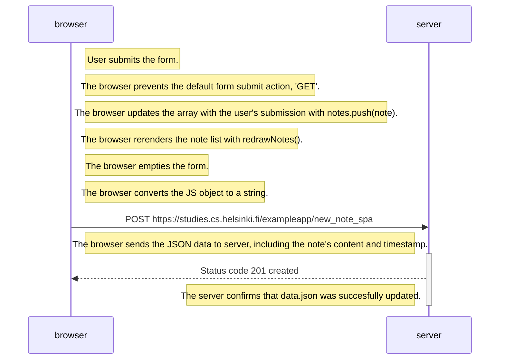

```mermaid
sequenceDiagram
  participant browser
  participant server

    Note right of browser: User submits the form.
    Note right of browser: The browser prevents the default form submit action, 'GET'.
    Note right of browser: The browser updates the array with the user's submission with notes.push(note).
    Note right of browser: The browser rerenders the note list with redrawNotes().
    Note right of browser: The browser empties the form.
    Note right of browser: The browser converts the JS object to a string.
  browser->>server: POST https://studies.cs.helsinki.fi/exampleapp/new_note_spa

    Note right of browser: The browser sends the JSON data to server, including the note's content and timestamp.
      activate server
  server-->>browser: Status code 201 created
    Note left of server: The server confirms that data.json was succesfully updated.
    deactivate server

```
