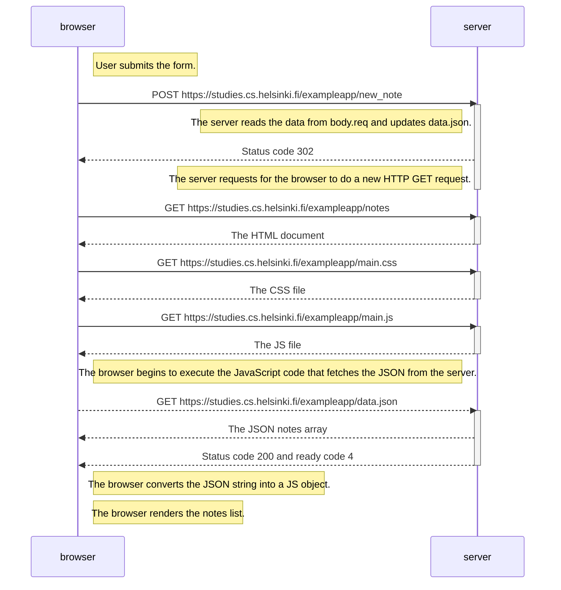

```mermaid
sequenceDiagram
  participant browser
  participant server

     Note right of browser: User submits the form.
  browser->>server: POST https://studies.cs.helsinki.fi/exampleapp/new_note
    activate server
    Note left of server: The server reads the data from body.req and updates data.json.
  server-->>browser: Status code 302
    Note left of server: The server requests for the browser to do a new HTTP GET request.
    deactivate server
  browser->>server: GET https://studies.cs.helsinki.fi/exampleapp/notes
      activate server
  server-->>browser: The HTML document
    deactivate server
  browser->>server: GET https://studies.cs.helsinki.fi/exampleapp/main.css
    activate server
  server-->>browser: The CSS file
    deactivate server
  browser->>server: GET https://studies.cs.helsinki.fi/exampleapp/main.js
    activate server
  server-->>browser: The JS file
    deactivate server
    Note right of browser: The browser begins to execute the JavaScript code that fetches the JSON from the server.
  browser-->>server: GET https://studies.cs.helsinki.fi/exampleapp/data.json
    activate server
  server-->>browser: The JSON notes array
  server-->>browser: Status code 200 and ready code 4
    deactivate server
    Note right of browser: The browser converts the JSON string into a JS object.
    Note right of browser: The browser renders the notes list.
```
